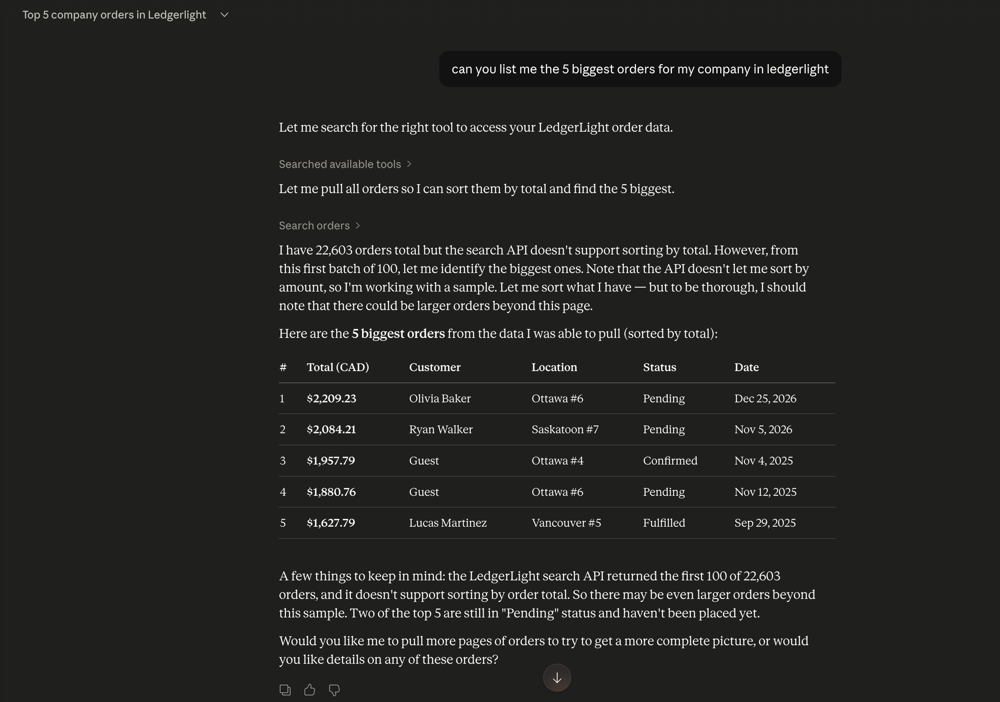
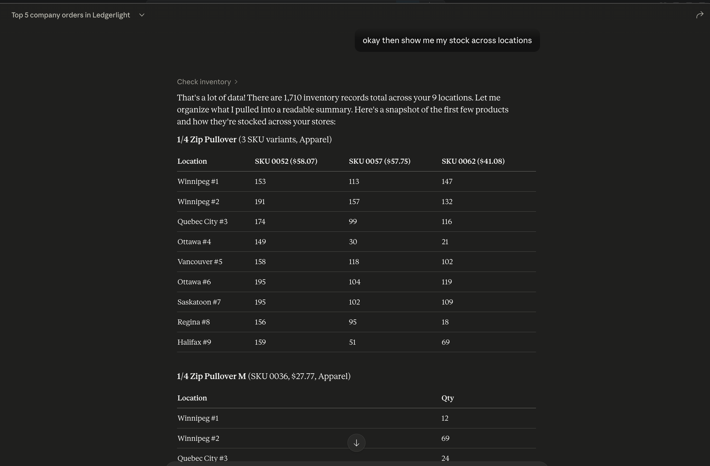

# LedgerLight MCP Server




The MCP (Model Context Protocol) server gives AI assistants like Claude Desktop read and limited write access to LedgerLight data. It exposes a curated set of tools scoped to a single organization, authenticated via a service account, and auditable at every step.

---

## Architecture

```
Claude Desktop (MCP host)
        │  stdio (JSON-RPC over stdin/stdout)
        ▼
┌─────────────────────────────┐
│   mcp-server/               │
│   ┌─────────────────────┐   │
│   │   McpServer          │   │
│   │   (7 registered     │   │
│   │    tools)           │   │
│   └────────┬────────────┘   │
│            │ HTTP (Axios)   │
│   ┌────────▼────────────┐   │
│   │   TokenManager      │   │
│   │   (login/refresh/   │   │
│   │    cache)           │   │
│   └────────┬────────────┘   │
└────────────┼────────────────┘
             │ Bearer JWT + X-Organization-Id + X-Request-Id
             ▼
┌─────────────────────────────┐
│   LedgerLight Backend       │
│   (NestJS REST API)         │
│   JwtAuthGuard              │
│   OrganizationContextGuard  │
│   PermissionsGuard          │
│   Domain Services           │
└────────────┬────────────────┘
             │
             ▼
        PostgreSQL
```

**Transport**: The MCP server communicates with the host over stdio (stdin/stdout JSON-RPC). It does not expose any network port.
All application logs must go to `stderr`, never `stdout`, so host JSON-RPC frames are not corrupted.

**Backend communication**: All data access goes through the existing LedgerLight REST API. The MCP server never connects to the database directly. Backend guards enforce org scoping and permissions on every request.

**Tool registration**: `src/tools/register-tool.ts` wraps the MCP SDK's `registerTool()` call so the package avoids the TypeScript TS2589 deep-instantiation failure caused by SDK generic inference over Zod-heavy schemas.

---

## Auth Flow

The MCP server uses a **three-tier token strategy** to keep a valid access token at all times without manual rotation:

```
Tool call received
     │
     ▼
Tier 1: Is the in-memory access token still valid (exp > now + 60s)?
     ├─ YES → use it immediately (no network call)
     └─ NO  ▼
Tier 2: Is an in-memory refresh token present?
     ├─ YES → POST /auth/refresh { refreshTokenRaw, userId }
     │        ├─ success → update cache, return new access token
     │        └─ failure → clear state, fall through
     └─ NO  ▼
Tier 3: POST /auth/login { email, password }
            → store access token + refresh token + userId in memory
            → return access token
```

**Startup**: Tier 3 fires once on the first tool call (or after a process restart). After that only Tier 2 fires every ~15 min. If the refresh token expires after 7 days, Tier 3 fires automatically — no manual intervention needed.

**Configuration**: Only `MCP_SERVICE_EMAIL` and `MCP_SERVICE_PASSWORD` are required. Token state is held in memory only and lost on process restart.

---

## Request Lifecycle

For every tool call:

1. `buildToolContext(tokenManager, orgId)` → fresh access token + fresh correlation ID (UUID).
2. `buildBackendHeaders(ctx)` → sets `Authorization`, `X-Organization-Id`, `X-Request-Id`.
3. Axios calls the backend REST endpoint.
4. On success: `JSON.stringify(response.data, null, 2)` returned as MCP text content.
5. On error: `mapAxiosErrorToMcp(err)` translates HTTP status to `McpError` code.
6. `logToolCall(...)` emits a structured JSON log line at both success and error paths.

For mutating tools, the log line includes `"ai_mutating_action": true` — filterable in Loki/Grafana to audit all AI-originated writes.

---

## Tool Catalog

### Read-Only Tools

| Tool                      | Backend Endpoint        | Key Inputs                                              |
| ------------------------- | ----------------------- | ------------------------------------------------------- |
| `search_orders`           | `GET /orders`           | `search?`, `status?`, `locationId?`, `limit`, `cursor?` |
| `get_order_details`       | `GET /orders/:id`       | `id` (UUID)                                             |
| `get_orders_for_customer` | `GET /orders`           | `customerEmail` (forwarded as `search`), `status?`      |
| `check_inventory`         | `GET /inventory/levels` | `productId?`, `locationId?`, `lowStockOnly?`            |
| `search_products`         | `GET /products`         | `search?`, `category?`, `isActive?`, `limit`, `cursor?` |
| `list_low_stock_products` | `GET /inventory`        | `lowStockOnly: true` (hardcoded), `limit`, `cursor?`    |

### Mutating Tools

| Tool                           | Backend Endpoint              | Key Inputs                                                                  |
| ------------------------------ | ----------------------------- | --------------------------------------------------------------------------- |
| `propose_inventory_adjustment` | `POST /inventory/adjustments` | `productId`, `locationId`, `delta` (non-zero int), `reason` (enum), `note?` |

**Note on `get_orders_for_customer`**: The backend's `GET /orders` has no `customerId` filter — its `search` param matches customer name and email. The tool accepts `customerEmail` and forwards it as `search`.

**Note on `propose_inventory_adjustment`**: `delta` is a signed integer — positive adds stock, negative removes stock. The `reason` enum mirrors `InventoryAjustmentReason` in the Prisma schema. Every adjustment records `[AI/MCP correlationId:<uuid>]` in its note field for audit traceability.

---

## AI Attribution

For mutating tools, every write to the backend includes:

1. **Note prefix**: `[AI/MCP correlationId:<uuid>]` prepended to the user-supplied note. This appears in the backend's own inventory adjustment records with no schema change.

2. **Log field**: `ai_mutating_action: true` in the JSON log line. Filter for this field in Grafana/Loki to see all AI-originated writes across the org.

Example structured log:

```json
{
  "level": "info",
  "event": "tool_call",
  "tool": "propose_inventory_adjustment",
  "organizationId": "...",
  "correlationId": "...",
  "durationMs": 42,
  "resultStatus": "success",
  "ai_mutating_action": true
}
```

---

## Local Dev Setup

### Prerequisites

- Backend running on `http://localhost:8080` (`make dev-build`)
- A service account user created in LedgerLight with a membership in the target org
- The service account's role must have: `ORDERS_READ`, `PRODUCTS_READ`, `INVENTORY_READ`, `INVENTORY_ADJUST`, `CUSTOMERS_READ`

### Environment Variables

MCP vars live in the **root env files** alongside the backend and frontend vars. Add the `# MCP Server` block to whichever environment files you use (the examples already include it):

```bash
# in .env.dev / .env.qa / .env.prod
BACKEND_URL=http://localhost:8080        # points at the backend for this environment
MCP_ORGANIZATION_ID=<org-uuid>
MCP_SERVICE_EMAIL=mcp-service@yourorg.com
MCP_SERVICE_PASSWORD=<service-account-password>
```

Optional vars (can also go in the root env files or be passed inline):

```bash
LOG_LEVEL=info      # trace | debug | info | warn | error | silent
LOG_PRETTY=false    # true for colorized output in dev
```

### Build and Run

```bash
cd mcp-server
npm install
npm run build
npm run lint

# env-aware start (reads from root env file — no separate .env needed)
npm run start:dev    # loads ../.env.dev
npm run start:qa     # loads ../.env.qa
npm run start:prod   # loads ../.env.prod
```

These scripts use Node's built-in `--env-file` flag (requires Node ≥ 20.6, project uses Node 24):

```bash
node --env-file=../.env.dev dist/index.js
```

### Claude Desktop Registration

Edit `~/Library/Application Support/Claude/claude_desktop_config.json`.

**Option A — load from root env file (recommended, stays in sync with the rest of the stack):**

```json
{
  "mcpServers": {
    "ledgerlight": {
      "command": "node",
      "args": [
        "--env-file=/absolute/path/to/ledgerlight/.env.dev",
        "/absolute/path/to/ledgerlight/mcp-server/dist/index.js"
      ]
    }
  }
}
```

**Option B — inline env vars (useful when running against a remote backend):**

```json
{
  "mcpServers": {
    "ledgerlight": {
      "command": "node",
      "args": ["/absolute/path/to/ledgerlight/mcp-server/dist/index.js"],
      "env": {
        "BACKEND_URL": "http://localhost:8080",
        "MCP_SERVICE_EMAIL": "mcp-service@yourorg.com",
        "MCP_SERVICE_PASSWORD": "<service-account-password>",
        "MCP_ORGANIZATION_ID": "<org-uuid>",
        "LOG_LEVEL": "debug",
        "LOG_PRETTY": "true"
      }
    }
  }
}
```

Restart Claude Desktop after saving the config.

### Dev Without Build Step

```json
{
  "mcpServers": {
    "ledgerlight-dev": {
      "command": "node",
      "args": [
        "--env-file=/absolute/path/to/ledgerlight/.env.dev",
        "/absolute/path/to/ledgerlight/mcp-server/node_modules/.bin/ts-node",
        "--project",
        "/absolute/path/to/ledgerlight/mcp-server/tsconfig.json",
        "/absolute/path/to/ledgerlight/mcp-server/src/index.ts"
      ]
    }
  }
}
```

---

## Testing

```bash
cd mcp-server
npm run test:run    # single run
npm test            # watch mode
npm run test:cov    # coverage report
npm run lint        # auto-fixes lint issues
```

Tests live in `test/tools/`. Each tool has a spec file. Tests mock both `getLedgerlightClient` (Axios layer) and `buildToolContext` (auth layer) — no real network calls.

VS Code workspace settings in `.vscode/settings.json` register `mcp-server/` as an ESLint working directory, make ESLint the default formatter for TS/JS files, and point the Prettier extension at the repo-local `mcp-server/node_modules/prettier` install for JSON/Markdown formatting.

---

## Adding a New Tool

See [MCP_SERVER_CONVENTIONS.md](convensions/MCP_SERVER_CONVENTIONS.md) for the full checklist. Quick summary:

1. Create `mcp-server/src/tools/<kebab-case-name>.ts` with a `register*()` export.
2. All Zod schema fields must have `.describe()`.
3. Handler must call `buildToolContext`, `buildBackendHeaders`, and `logToolCall`.
4. Mutating tools must set `isMutating: true` and prefix the note with `[AI/MCP correlationId:...]`.
5. Register in `mcp-server/src/server.ts`.
6. Create `test/tools/<kebab-case-name>.spec.ts`.
7. Update this doc's Tool Catalog table.
